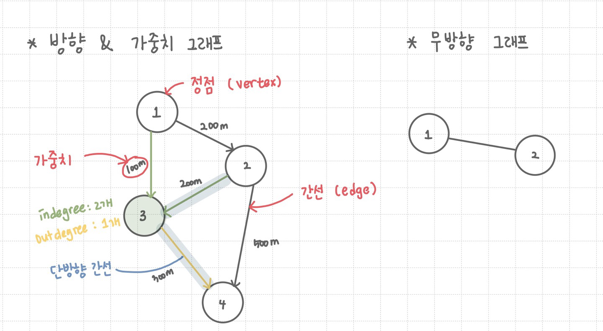
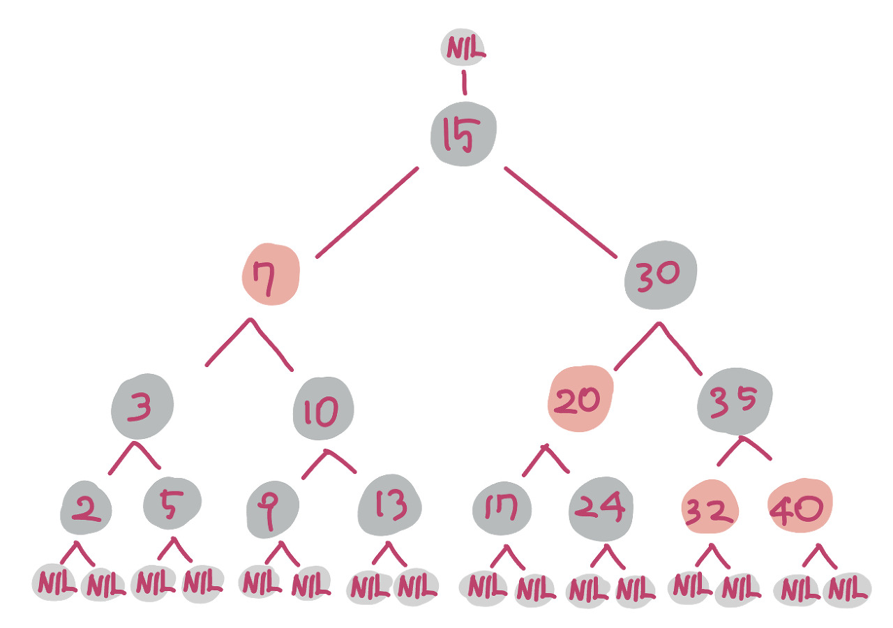

# 비선형 자료 구조

- table of contents

# 그래프(Graph)

정점과 간선으로 이루어진 자료 구조



## 용어

- 정점(vertex/node) : 어느 한 곳, 위치
- 간선(edge) : 정점과 정점을 연결하는 선
- 가중치 : 정점과 정점 사이에 드는 비용
- 인접 정점 : 간선에 의해 직접 연결된 정점
- 정점의 차수 : 무방향 그래프에서 하나의 정점에 인접한 정점의 수
    - 무방향 그래프에 존재하는 정점의 모든 차수의 합 = 그래프 간선 개수 * 2
- 내차수 / 진입 차수 (indegree) : 외부에서 오는 간선의 수
- 외차수 / 진출 차수 (outdegree) : 외부로 나가는 간선의 수
- 사이클 : 단순 경로의 시작 정점과 종료 정점이 동일한 경우

## 그래프의 종류

- 방향 그래프 : 간선에 방향성이 존재하는 그래프
- 무방향 그래프 : 간선에 방향성이 존재하지 않는, 즉 양방향으로 이동이 가능한 그래프
- 가중치 / 네트워크 그래프 : 간선에 비용이나 가중치가 할당된 그래프
- 연결 그래프 : 무방향 그래프에 있는 모든 정점쌍에 대해서 항상 경로가 존재하는 경우
- 비연결 그래프 : 무방향 그래프에서 특정 정점쌍 사이에 경로가 존재하지 않는 경우
- 사이클 그래프 : 단순 경로(경로 중 반복되는 정점이 없는 경우)의 시작 정점과 종료 정점이 동일한 경우
- 비순환 그래프 : 사이클이 없는 그래프
- 완전 그래프 : 그래프에 속해 있는 모든 정점이 서로 연결되어 있는 그래프
    - 무방향 완전 그래프의 경우 간선의 수 = {정점의 수 * (정점의 수 - 1)} / 2

## 그래프의 특징

- 루트 노드 개념이 없다
- 부모-자식 관계의 개념이 없다
- 순회는 dfs 또는 bfs 로 이루어진다
- 그래프는 순환 또는 비순환이다

## 그래프 구현 방법


1. 인접 행렬
    - 그래프에 간선이 많이 존재하는 경우 적합
    - 장점
        - 두 정점을 연결하는 간선의 존재 여부 `M[i][j]` 를  빠르게(`O(1)`) 알 수 있다
        - 정점의 차수는 `O(N)` 안에 알 수 있다 (인접 배열의 i 번째 행 또는 열을 전부 더함)
    - 단점
        - 어떤 노드에 인접한 노드들을 찾기 위해서는 모든 노드를 전부 순회해야 한다
        - 그래프에 존재하는 모든 간선의 수는 `O(N^2)` 안에 알 수 있다 (인접 행렬 전체를 조사)
2. 인접 리스트
    - 그래프 내에 적은 숫자의 간선만을 가지는 경우 적합
    - 장점
        - 어떤 노드에 인접한 노드들을 쉽게 찾을 수 있다
        - 그래프에 존재하는 모든 간선의 수는 `O(N+E)` 안에 알 수 있다 (인접 리스트 전체를 조사)
    - 단점
        - 정점 차수만큼의 시간이 필요하다 (= 정점 i의 리스트에 있는 노드의 수만큼 시간이 필요함)

## 그래프 탐색


### BFS(Breadth-First Search)

그래프와 트리의 가장 가까운 노드부터 탐색하는 알고리즘

- 특징
    - Queue 자료구조를 이용함
    - 탐색 시 `O(N)`의 시간 소요
- 구현
    1. 탐색 시작 노드를 큐에 삽입하고 방문 처리
    2. 큐에서 노드를 꺼내 해당 노드의 인접 노드 중 방문하지 않은 노드를 큐에 삽입하고 방문처리
    3. 큐가 빌때까지 2 반복
    
    ```java
    class Main {
    		static List<List<Integer>> adj;
        static boolean[] v;
        static StringBuilder sb;
        public static void main(String[] args) throws IOException {
    
            int N = 7;
            adj = new ArrayList<>();
            adj.add(Arrays.asList());
            adj.add(Arrays.asList(2,3,4));
            adj.add(Arrays.asList(5,6));
            adj.add(Arrays.asList());
            adj.add(Arrays.asList(7));
            adj.add(Arrays.asList());
            adj.add(Arrays.asList());
            adj.add(Arrays.asList());
    
            v = new boolean[N+1];
    
    				sb = new StringBuilder();
            sb.append(1 + " ");
            bfs(1);
            System.out.println(sb.toString());
        }
        private static void bfs(int start){
            Queue<Integer> q = new ArrayDeque<>();
            q.offer(start);
            v[start] = true;
    
            while(!q.isEmpty()){
                int now = q.poll();
                for(int i=0; i < adj.get(now).size(); i++){
                    int temp = adj.get(now).get(i);
                    if (!v[temp]){
                        v[temp] = true;
                        sb.append(temp + " ");
                        q.offer(temp);
                    }
                }
            }
        }
    }
    
    // 1 2 3 4 5 6 7
    ```
    

### DFS(Depth-First Search)

그래프와 트리의 깊은 부분을 우선적으로 탐색하는 알고리즘

- 특징
    - Stack 자료구조를 이용함 (재귀함수를 이용할 수도 있음)
    - 실제 수행 시간은 BFS 에 비해 느림
    - 탐색 시 `O(N)`의 시간 소요
- 구현
    1. 탐색 시작 노드를 스택에 삽입하고 방문 처리
    2. 스택의 최상단 노드에 방문하지 않은 인접 노드가 있으면 그 인접 노드를 스택에 넣고 방문처리
    3. 방문하지 않은 인접 노드가 없으면 스택에서 최상단 노드를 꺼냄
    4. 스택이 빌 때까지 2~3 반복
    
    ```java
    // 재귀로 구현
    class Main {
    		static List<List<Integer>> adj;
        static boolean[] v;
        static StringBuilder sb;
        public static void main(String[] args) throws IOException {
    
            int N = 7;
            adj = new ArrayList<>();
            adj.add(Arrays.asList());
            adj.add(Arrays.asList(2,3,4));
            adj.add(Arrays.asList(5,6));
            adj.add(Arrays.asList());
            adj.add(Arrays.asList(7));
            adj.add(Arrays.asList());
            adj.add(Arrays.asList());
            adj.add(Arrays.asList());
    
            v = new boolean[N+1];
    
            sb = new StringBuilder();
            sb.append(1 + " ");
            dfs(1);
            System.out.println(sb.toString());
    
        }
    
        private static void dfs(int start){
            v[start] = true;
            for (int i = 0; i < adj.get(start).size(); i++) {
                int temp = adj.get(start).get(i);
                if (!v[temp]){
                    sb.append(temp + " ");
                    dfs(temp);
                }
            }
        }
    }
    
    // 1 2 5 6 3 4 7
    ```
    

# 트리(Tree)

연결그래프이면서 사이클이 없는 그래프


### *트리가 되기 위한 조건 (3가지 중 2개만 충족해도 됨)

1. 연결그래프
2. 사이클이 없다
3. 정점의 수 - 간선의 수 = 1

## 용어

- 깊이 : 트리에서의 깊이는 각 노드마다 다르며, 루트 노드부터 특정 노드까지 최단 거리
- 높이 : 루트 노드부터 리프 노드까지 거리 중 가장 긴 거리
- 서브 트리 : 트리 내의 하위 집합
- 차수(degree) : 한 노드가 가진 자식 노드의 수
- 트리의 차수 : 트리의 모든 노드 중 가장 높은 차수

## 트리의 구성 요소

- 루트 노드 : 가장 위에 있는 노드
- 내부 노드 : 루트 노드와 내부 노드 사이의 노드
- 리프 노드 : 자식이 없는 노드

## 트리의 특징

- 부모-자식 계층 구조를 가짐
- 간선의 수 = 노드 수 - 1
- 트리 내의 어떤 노드와 어떤 노드까지의 경로는 반드시 있음

## 트리의 종류

### 이진 트리 (Binary Tree)

*자식의 노드 수가 두개 이하인 트리*

1. **포화이진트리 (Perfect Binary Tree)**
    
    
    
    - 트리의 모든 노드가 꽉 차 있는 트리
        - 노드가 2개의 자식을 갖고 있음
    - 모든 단말 노드부터 루트 노트까지의 높이가 같다
    - 노드의 개수 = 2*트리의 높이 - 1
2. 완전이진트리 (Complete Binary Tree)
    
    
    
    - 트리의 마지막 레벨 바로 전까지 꽉 차있고, 마지막 레벨에서 왼쪽부터 차례대로 채워져있는 트리
    - 노드의 개수 < 2*트리의 높이 - 1
    - 힙(heap)이랑 연관됨
3. 편향이진트리 (Skewed Binary Tree)
    
    
    
    - 왼쪽 또는 오른쪽으로 편향되게 채워져있는 트리
    - 각각의 높이에서 1개의 노드만 있음
    - 트리의 높이 ≤ 노드의 개수 ≤ 2*트리의높이 - 1
4. 정이진트리 (Full Binary Tree)
    
    
    
    - 모든 노드가 0개 또는 2개의 자식 노드만을 갖는 트리
    - 2*트리의 높이 + 1 ≤ 노드의 개수 ≤ 2*(트리의 높이+1) - 1
5. 균형이진트리 (Balanced Binary Tree)
    
    
    
    - 모든 노드의 왼쪽과 오른쪽 서브 트리의 높이가 1 이상 차이가 나지 않는 트리

### 이진 탐색 트리(Binary Search Tree)

*이진탐색과 연결리스트를 결합한 자료구조의 일종*

| 구분 | 장점 | 단점 |
| --- | --- | --- |
| 이진탐색 | 탐색 시간 복잡도 O(logN) | - |
| 연결리스트 | 삽입/삭제 시 O(1) 소요 | 탐색 시간 복잡도 O(N) |


- 특징
    - 각 노드의 자식이 2개 이하
    - 각 노드의 왼쪽 자식은 부모보다 값이 작고, 오른쪽 자식은 부모보다 값이 크다
    - 중복된 노드가 없어야 한다
    - 왼쪽 서브트리, 오른쪽 서브트리 또한 이진탐색트리이다
    - 중위순회
- 연산
    - 검색 `O(log N)`
        - 찾고자 하는 값과 현재 루트 노드의 값을 비교하여,
        - 타겟 값이 더 크다면 오른쪽 서브트리로, 타겟 값이 작다면 왼쪽 서브트리로 이동한다
        - 위 로직을 재귀적으로 수행, 루트 노드의 값이 타겟 데이터일 때까지 탐색
    - 삽입 `O(log N)`
        - 새로운 데이터가 들어갈 자리가 비어있으면 그대로 값 대입
        - ~~비어있지 않은 경우 해당 자리의 노드 값과 비교하여 삽입할 데이터보다 작다면 왼쪽 자식트리로 이동, 삽입할 데이터보다 크다면 오른쪽 자식 트리로 이동~~
    - 삭제 `O(log N)`
        - 리프 노드를 삭제하는 경우 : 그냥 삭제
        - 자식 노드가 하나인 노드를 삭제하는 경우 : 해당 자식 노드를 삭제할 노드의 위치로 끌어올림
        - 자식 노드가 두개인 노드를 삭제하는 경우 : 오른쪽 서브트리의 min 값 또는 왼쪽 서비트리의 max 값 중 하나를 삭제할 노드의 위치로 끌어올림
- 시간 복잡도 : `O(log N), N = 트리의 높이`
    
    
    
    - 트리의 높이에 비례하여 시간 복잡도가 증가함
    - 그러나 트리의 구조가 선형적일 경우 `O(N)`

### AVL(Adelson-Velsky and Landis Tree)

*스스로 균형을 잡는 이진 트리*


- 특징
    - 이진 탐색 트리의 속성을 가짐
    - 왼쪽, 오른쪽 서브 트리의 높이 차가 최대 1
    - 어떤 시점에서 높이 차가 1보다 커지면 왼쪽 또는 오른쪽으로 회전을 통해 균형을 잡아 높이 차를 줄임
- Balanced Factor(BF)
    - 왼쪽 서브트리의 높이에서 오른쪽 서브트리의 높이를 뺀 값
    - BF = 1 : 왼쪽 서브트리가 오른쪽 서브트리보다 높이가 한단계 높음
    - BF = 0 : 왼쪽 서브트리와 오른쪽 서브트리의 높이가 같음
    - BF = -1 : 왼쪽 서브트리가 오른쪽 서브트리보다 높이가 한단계 낮음
- 시간 복잡도
    - 높이를 logN으로 유지하기 때문에 삽입, 검색, 삭제의 시간 복잡도는 `O(logN)`
- 회전(Rotation)
    - 참고 블로그 (발표자가 이해를 못함ㅠㅠ)
        
        [https://yoongrammer.tistory.com/72](https://yoongrammer.tistory.com/72)
        
    
    *삽입 또는 삭제 시 BF가 변경될 수 있으며, -1 ≤ BF < 1 이 아닌 경우 AVL 트리는 불균형 노드를 기준으로 서브트리의 위치를 변경하여 트리의 균형을 맞춤*
    
    1. LL 불균형
        
        
        
        - y 노드의 오른쪽 자식 노드를 z 노드로 변경
        - z 노드의 왼쪽 자식 노드를 y 노드 오른쪽 서브트리로 변경
        - y 는 새로운 루트 노드가 됨
    2. RR 불균형
        
        
        
        - y 노드의 왼쪽 자식 노드를 z 노드로 변경
        - z 노드 오른쪽 자식 노드를 y 노드 왼쪽 서브트리로 변경
        - y 는 새로운 루트 노드가
    3. LR 불균형
        
        
        
    4. RL 불균형
        
        
        

### 레드 블랙 트리 (Red-Black Tree)

*자가 균형 이진 탐색 트리의 한 종류*


- 특징
    1. 모든 노드는 Red 이거나 Black 이다
    2. 루트 노드는 Black 이다
    3. 모든 리프노드(=NIL 노드)는 Black 이다
    4. 노드가 Red 면 자식은 Black 이다
    5. 루트 노드에서 모든 리프 노드까지의 경로에서 만나는 Black 노드의 수는 같다
- NIL 노드
    - Null을 대체하는 임의의 노드
    - 레드블랙트리에서는 자식이 없는 노드를 NIL 노드라고 한다
    - 노드가 자식이 없을 때 (노드.left = NIL, 노드.right= NIL 과 같은 노드) 노드의 NIL 자식을 표현하기 위해 경계노드를 이용
        
        
        
    - 그러나 모든 NIL 들에 메모리를 부과하면 낭비 → 하나의 T.nil 로 연결
        
        
        
- 흑색 높이
    
    *한 노드 x에서 x의 자손 리프까지의 경로에 있는 모든 흑색 노드(x 자신은 제외, 리프노드는 포함)의 개수*
    
    - 임의의 노드에서 모든 자식 리프까지의 경로에 있는 모든 흑색노드의 수는 동일함
        
        
        
- 연산
    - 참고 블로그 (발표자가 이해를 못함ㅠㅠ2)
        
        [https://stay-present.tistory.com/78](https://stay-present.tistory.com/78)
        
        [https://codable.tistory.com/16](https://codable.tistory.com/16)
        
        [https://hongcoding.tistory.com/178](https://hongcoding.tistory.com/178)
        
    - 삽입
        - 새로운 노드는 항상 Red 노드로 추가한다
        - 만약 Red-Red 상황이 발생하면 삼촌의 색을 확인한다
            - 삼촌의 색이 Red 라면 조부모에게 Red 을 모아서 올려줌
            - 삼촌의 색이 Black 이라면 회전을 통해 해결
    - 삭제
        - Red 노드를 삭제할 때는 그냥 수행하면 됨
        - Black 노드를 삭제할 때는 레드-블랙 트리 조건을 유지해야 함 → 삽입 연산때 처럼 rotation을 통해 해결
- 시간복잡도 : 최악의 경우에도 `O(log N)`
- 회전 : 이진트리의 특성을 보존하면서 트리의 균형을 맞춤
    - 좌회전
        
        
        
        
        
        
        
        - x와  y(x의 오른쪽 자식)를 연결하는 간선을 중심축으로 회전
        - 서브 트리의 새로운 루트 : y
        - y의 오른쪽 자식 : x
        - y의 왼쪽 자식은 x의 오른쪽 자식이 된다
- 장점
    - 최악의 경우에도 일정한 실행 시간 보장
    - 성능이 좋아 실행시간이 중요한 경우 유용하며, 일정한 실행시간을 보장하는 다른 자료구조를 만드는데도 유용함
- 단점
    - 이해하기 어렵고 구현이 복잡함
